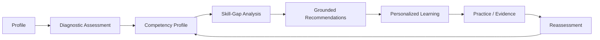
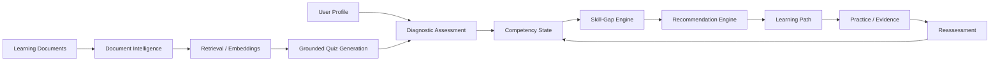
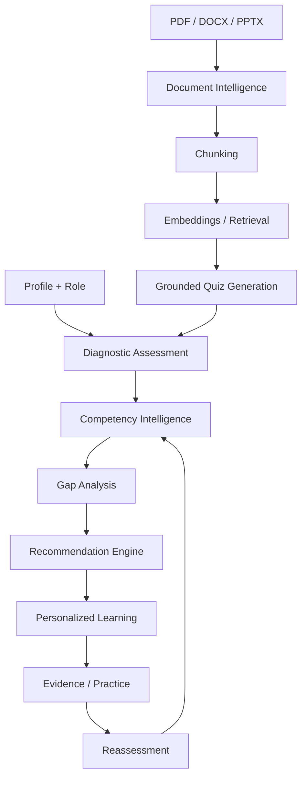
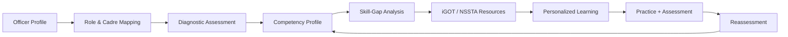
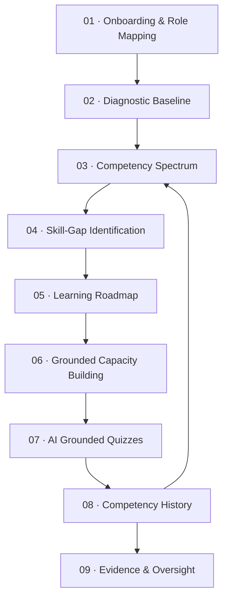
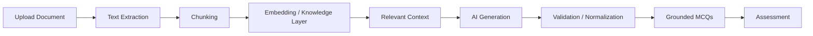
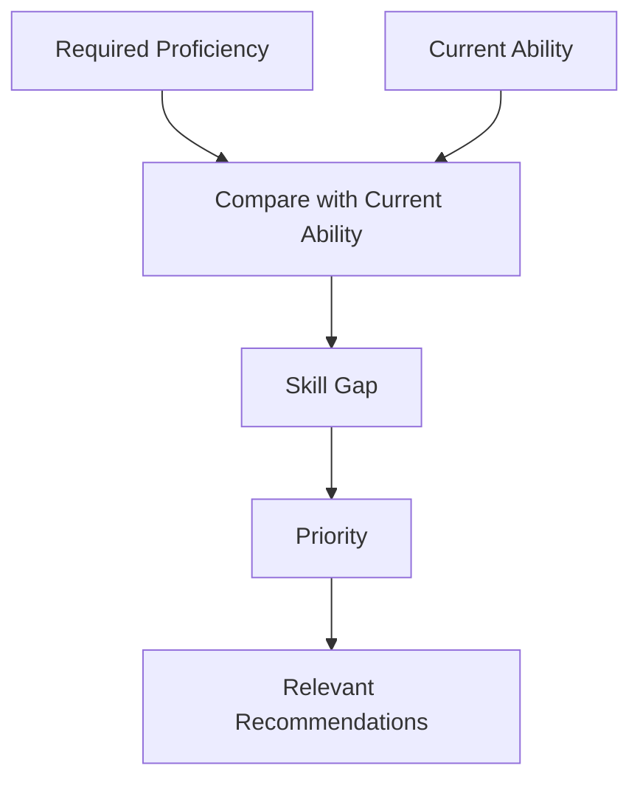
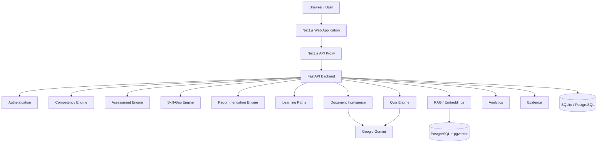
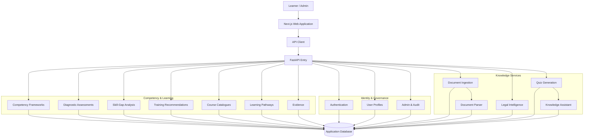
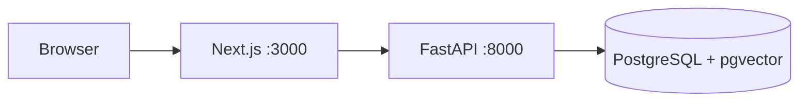

# STAT-SKILL AI

### AI-Powered Competency Intelligence Platform

**Assess → Diagnose → Learn → Reassess**

STAT-SKILL AI is a competency intelligence platform for **Government, Industry, and Academia**. It combines structured assessment, competency mapping, skill-gap analysis, grounded recommendations, personalized learning paths, document intelligence, and continuous reassessment.

[](https://stat-skill-ai-psi.vercel.app)
[](https://www.sih.gov.in/)
[](https://nextjs.org/)
[](https://fastapi.tiangolo.com/)
[](https://www.typescriptlang.org/)

**Live Platform:** https://stat-skill-ai-psi.vercel.app

---

## Table of Contents

<table>
<tr>
<td bgcolor="#EEF6FF"><a href="#overview">Overview</a></td>
<td bgcolor="#F3F4F6"><a href="#the-problem">The Problem</a></td>
<td bgcolor="#EEF6FF"><a href="#platform-approach">Platform Approach</a></td>
<td bgcolor="#F3F4F6"><a href="#core-intelligence-engine">Core Intelligence Engine</a></td>
</tr>
<tr>
<td bgcolor="#F3F4F6"><a href="#specialized-tracks">Specialized Tracks</a></td>
<td bgcolor="#EEF6FF"><a href="#key-capabilities">Key Capabilities</a></td>
<td bgcolor="#F3F4F6"><a href="#how-it-works">How It Works</a></td>
<td bgcolor="#EEF6FF"><a href="#document-to-quiz-intelligence">Document-to-Quiz Intelligence</a></td>
</tr>
<tr>
<td bgcolor="#EEF6FF"><a href="#skill-gap-intelligence">Skill-Gap Intelligence</a></td>
<td bgcolor="#F3F4F6"><a href="#platform-architecture">Platform Architecture</a></td>
<td bgcolor="#EEF6FF"><a href="#complete-repository-working-flow">Complete Repository Working Flow</a></td>
<td bgcolor="#F3F4F6"><a href="#technology-stack">Technology Stack</a></td>
</tr>
<tr>
<td bgcolor="#F3F4F6"><a href="#repository-structure">Repository Structure</a></td>
<td bgcolor="#EEF6FF"><a href="#application-routes">Application Routes</a></td>
<td bgcolor="#F3F4F6"><a href="#getting-started">Getting Started</a></td>
<td bgcolor="#EEF6FF"><a href="#local-api-access">Local API Access</a></td>
</tr>
<tr>
<td bgcolor="#EEF6FF"><a href="#docker">Docker</a></td>
<td bgcolor="#F3F4F6"><a href="#testing--build">Testing &amp; Build</a></td>
<td bgcolor="#EEF6FF"><a href="#deployment">Deployment</a></td>
<td bgcolor="#F3F4F6"><a href="#security--data-handling">Security &amp; Data Handling</a></td>
</tr>
<tr>
<td bgcolor="#F3F4F6"><a href="#design-principles">Design Principles</a></td>
<td bgcolor="#EEF6FF"><a href="#project-status">Project Status</a></td>
<td bgcolor="#F3F4F6"><a href="#useful-links">Useful Links</a></td>
<td bgcolor="#EEF6FF"><a href="#contributing">Contributing</a></td>
</tr>
<tr>
<td bgcolor="#EEF6FF"><a href="#license">License</a></td>
<td bgcolor="#F3F4F6"><a href="#government--official-statistics">Government</a></td>
<td bgcolor="#EEF6FF"><a href="#industry--analytics--professional-development">Industry</a></td>
<td bgcolor="#F3F4F6"><a href="#academia--curriculum--employability">Academia</a></td>
</tr>
</table>

---

## Overview

The platform is built around one principle:

> **Identify the competency gap before recommending learning.**

Instead of treating learning as a catalogue of courses, STAT-SKILL AI establishes a competency baseline, identifies gaps against required levels, maps relevant resources, and updates the competency state after reassessment.

### Core Lifecycle



### Supported Tracks

| Track | Primary Purpose | Example Areas |
|---|---|---|
| **Government** | Statistical workforce capacity building | Survey methodology, sampling, national accounts, price indices, official statistics |
| **Industry** | Analytics and professional development | SQL, BI, data analytics, econometrics, statistical modelling |
| **Academia** | Curriculum and employability alignment | Course outcomes, competency mapping, internship readiness |

The **Government track is the primary SIH-oriented implementation**, while Industry and Academia reuse the same competency intelligence architecture for adjacent use cases.

---

## The Problem

Traditional learning systems commonly begin with available courses. STAT-SKILL AI begins with the learner's current competency and the required competency level.

The platform addresses:

- Competency being inferred from qualifications instead of demonstrated ability
- Difficulty identifying specific skill deficiencies
- Recommendations that are not directly connected to measurable gaps
- Domain-specific capacity-building requirements
- Disconnected learning-material and assessment workflows
- Unstructured AI recommendations without sufficient source grounding
- Lack of continuous competency history

---

## Platform Approach

STAT-SKILL AI separates **measurement**, **diagnosis**, and **recommendation**.



### Why this structure matters

- Assessment establishes a measurable baseline.
- Skill gaps are calculated against defined targets.
- Recommendations are connected to competency, role, track, priority, and resources.
- Source-grounded generation is used where document context is required.
- Competency state can persist across assessment events.
- The same intelligence engine can support multiple competency frameworks.

---

## Core Intelligence Engine

The shared **AI Competency Intelligence Engine** is the central intelligence layer of the platform.



| Layer | Responsibility |
|---|---|
| **Assessment Engine** | Establishes measurable competency baselines |
| **Competency Engine** | Maintains proficiency state and history |
| **Gap Engine** | Calculates shortfalls against required levels |
| **Recommendation Engine** | Maps gaps to relevant learning resources |
| **Learning Path Engine** | Converts gaps into sequenced development plans |
| **Document Intelligence** | Extracts knowledge from uploaded material |
| **RAG / Retrieval Layer** | Retrieves relevant source context |
| **Quiz Engine** | Produces structured, source-grounded assessments |
| **Analytics** | Aggregates competency and learning progress |
| **Evidence Layer** | Stores competency-related evidence and submissions |

---

## Specialized Tracks

### Government: Official Statistics

The Government track is the primary SIH-oriented workflow.

Key competency areas include:

- Survey methodology
- Sampling methodology
- Statistical analysis
- National accounts
- CPI / WPI and price indices
- Official statistical data production
- Statistical workflows
- Role-specific statistical competencies



### Industry: Analytics & Professional Development

The Industry track applies the same competency engine to professional analytics roles.

Example areas:

- SQL
- Data analytics
- Business intelligence
- Econometrics
- Statistical modelling
- Data interpretation
- Applied analytical projects
- Role-oriented skill development

### Academia: Curriculum & Employability

The Academia track connects academic learning with demonstrated competency.

Example workflows:

- Curriculum mapping
- Course Outcome alignment
- Student competency assessment
- Skill-gap identification
- Internship readiness
- Personalized learning
- Evidence portfolio development

---

## Key Capabilities

| Capability | Description |
|---|---|
| **Diagnostic Assessment** | Establishes a measurable competency baseline |
| **Competency Intelligence** | Maintains proficiency state, history, and evidence |
| **Skill-Gap Analysis** | Compares current proficiency with required benchmarks |
| **Grounded Recommendations** | Maps identified gaps to relevant resources |
| **Learning Paths** | Converts gaps into structured development journeys |
| **Document Intelligence** | Extracts content from PDF, DOCX, and PPTX files |
| **AI Quiz Generation** | Generates structured MCQs from relevant source material |
| **RAG / Embeddings** | Enables semantic retrieval over indexed content |
| **Progress Analytics** | Tracks competency development and learning activity |
| **Evidence Layer** | Supports evidence-oriented competency development |
| **Track / Tenant Isolation** | Enforces server-side data access boundaries |
| **Government Catalogue Adapters** | Supports iGOT Karmayogi / NSSTA-oriented resource mapping |

---

## How It Works

The platform follows a nine-stage competency lifecycle:



| Stage | Purpose |
|---|---|
| **01   Onboarding & Role Mapping** | Establishes sector, role, competency framework, and target requirements |
| **02   Diagnostic Baseline** | Establishes the starting competency state |
| **03   Competency Spectrum** | Maps results into defined proficiency tiers |
| **04   Skill-Gap Identification** | Compares current proficiency with target requirements |
| **05   Learning Roadmap** | Converts priority gaps into an ordered learning pathway |
| **06   Grounded Capacity Building** | Maps relevant resources, including configured iGOT / NSSTA pathways |
| **07   AI Grounded Quizzes** | Converts learning material into source-grounded assessment content |
| **08   Competency History** | Persists assessment events and historical competency changes |
| **09   Evidence & Oversight** | Supports competency evidence and authorized institutional views |

---

## Document-to-Quiz Intelligence

Supported formats:

- PDF
- DOCX
- PPTX



Generated assessment content can include:

- Question
- Multiple options
- Correct answer
- Explanation
- Difficulty
- Competency mapping
- Source / page reference where available

---

## Skill-Gap Intelligence

The platform separates measurement from recommendation.



A competency record can incorporate:

| Field | Purpose |
|---|---|
| Current score | Measured proficiency |
| Required score / level | Target proficiency |
| Gap | Difference between current and required level |
| Priority | Relative importance of the gap |
| Status | Current competency state |
| Assessment attempt | Assessment context |
| Confidence / history metadata | Supporting competency context |
| Last update | Most recent competency change |

---

## Platform Architecture



### Architecture Characteristics

- Frontend / backend separation
- Next.js API proxy
- Domain-oriented FastAPI modules
- SQLAlchemy-based persistence
- SQLite for lightweight development
- PostgreSQL + pgvector for production-oriented retrieval
- Provider-aware AI generation
- Server-side authorization and data isolation
- Modular competency frameworks
- Reusable engine across Government, Industry, and Academia

---

## Complete Repository Working Flow

The following diagram shows how the repository components connect during application execution.



---

## Technology Stack

### Frontend

| Technology | Purpose |
|---|---|
| **Next.js 14** | Application framework |
| **React 18** | UI layer |
| **TypeScript 5.x** | Type-safe development |
| **Tailwind CSS** | Styling and design system |
| **Recharts** | Analytics and visualization |
| **Lucide React** | Interface icons |

### Backend

| Technology | Purpose |
|---|---|
| **Python 3.12** | Backend runtime |
| **FastAPI** | REST API |
| **Uvicorn** | ASGI server |
| **SQLAlchemy 2** | ORM / persistence |
| **Pydantic 2** | Validation and schemas |
| **JWT** | Authentication |
| **bcrypt / Passlib** | Password hashing |
| **pytest** | Backend testing |

### AI & Data

| Technology | Purpose |
|---|---|
| **Google Gemini** | AI generation / embeddings when configured |
| **RAG** | Grounded document intelligence |
| **PostgreSQL** | Production-oriented relational database |
| **pgvector** | Vector similarity search |
| **SQLite** | Lightweight local database |

### Deployment

| Platform | Role |
|---|---|
| **Vercel** | Live frontend deployment |
| **Render** | Backend deployment |
| **Docker Compose** | Local multi-service environment |
| **Railway** | Alternative backend deployment configuration |

---

## Repository Structure

```text
stat-skill-SIH-2026/
│
├── apps/
│   ├── web/                         # Next.js frontend
│   │   ├── src/
│   │   │   ├── app/                 # Pages and routes
│   │   │   └── components/          # Shared UI components
│   │   ├── Dockerfile
│   │   ├── package.json
│   │   └── vercel.json
│   │
│   └── api/                         # FastAPI backend
│       ├── app/
│       │   ├── admin/
│       │   ├── analytics/
│       │   ├── assessments/
│       │   ├── assistant/
│       │   ├── auth/
│       │   ├── catalogues/
│       │   ├── competencies/
│       │   ├── core/
│       │   ├── documents/
│       │   ├── evidence/
│       │   ├── frameworks/
│       │   ├── gaps/
│       │   ├── health/
│       │   ├── learning_paths/
│       │   ├── legal/
│       │   ├── models/
│       │   ├── quizzes/
│       │   ├── rag/
│       │   ├── recommendations/
│       │   ├── schemas/
│       │   ├── scraper/
│       │   ├── users/
│       │   └── main.py
│       ├── tests/
│       └── requirements.txt
│
├── packages/
│   └── shared-types/
│
├── scripts/
├── infra/
├── uploads/
├── docker-compose.yml
├── render.yaml
├── railway.json
├── Procfile
├── package.json
└── README.md
```

---

## Application Routes

| Route | Purpose |
|---|---|
| `/` | Platform landing page |
| `/login` | Authentication |
| `/register` | Learner registration |
| `/government` | Government / Official Statistics track |
| `/industry` | Industry / analytics track |
| `/academia` | Academia / curriculum track |
| `/features` | Platform capabilities |
| `/how-it-works` | Competency lifecycle |
| `/legal-intelligence` | Statutory / legal intelligence area |
| `/faq` | Frequently asked questions |

Authenticated areas include competency, assessments, gaps, recommendations, learning paths, documents, quizzes, evidence, analytics, and related workflows.

---

## Getting Started

### Prerequisites

- Node.js 18+
- npm
- Python 3.11+
- Git
- Docker and Docker Compose are optional

### 1. Clone the Repository

```bash
git clone https://github.com/syedroshanriyan/stat-skill-SIH-2026.git
cd stat-skill-SIH-2026
```

### 2. Install Frontend Dependencies

```bash
npm install
```

### 3. Create a Python Virtual Environment

**Windows**

```bash
python -m venv .venv
.venv\Scripts\activate
```

**Linux / macOS**

```bash
python3 -m venv .venv
source .venv/bin/activate
```

### 4. Install Backend Dependencies

```bash
pip install -r apps/api/requirements.txt
```

### 5. Configure Environment Variables

```env
DATABASE_URL=sqlite:///./statskill.db
JWT_SECRET=replace-with-a-secure-secret
CORS_ORIGINS=http://localhost:3000
GEMINI_API_KEY=your-gemini-api-key
```

Do not commit real API keys, database credentials, JWT secrets, or production environment values.

### 6. Start the Platform

```bash
npm start
```

For frontend-only development:

```bash
npm run dev:web
```

Then open:

```text
http://localhost:3000
```

---

## Local API Access

| Endpoint | Purpose |
|---|---|
| `/` | Landing page |
| `/login` | Authentication |
| `/register` | Registration |
| `/api/v1` | Versioned API |
| `/docs` | FastAPI Swagger documentation |
| `/redoc` | FastAPI ReDoc documentation |

---

## Docker



Start:

```bash
docker compose up --build
```

Stop:

```bash
docker compose down
```

The Docker configuration supports Next.js, FastAPI, PostgreSQL, pgvector, persistent database storage, and local upload storage.

---

## Testing & Build

### Backend Tests

```bash
python -m pytest apps/api/tests -v
```

### Frontend Build

```bash
npm run build:web
```

### Frontend Linting

```bash
npm run lint:web
```

---

## Deployment

### Live Application

**https://stat-skill-ai-psi.vercel.app**

The frontend is deployed from:

```text
apps/web
```

The Vercel root directory is:

```text
apps/web
```

The application uses the frontend API/proxy layer, so the backend service URL does not need to be exposed in this README.

### Backend Configuration

The repository contains deployment configuration for:

```text
render.yaml
Procfile
railway.json
```

---

## Security & Data Handling

The architecture includes:

- JWT-based authentication
- Password hashing
- Configurable CORS
- Environment-based secret management
- User-scoped data access
- Server-side authorization
- Track / tenant isolation
- Audit-oriented infrastructure
- Separation between presentation, API, and domain logic
- Permission-aware document and retrieval workflows

Security features should not automatically be interpreted as a legal or regulatory compliance certification. Production deployments should independently validate applicable privacy, security, retention, encryption, audit, residency, incident-response, and third-party AI-provider requirements.

---

## Design Principles

| Principle | Description |
|---|---|
| **Evidence before assumptions** | Competency should be supported by assessment results and evidence |
| **Gap before recommendation** | Identify what is missing before recommending learning |
| **Grounded AI** | Keep source-grounded generation connected to relevant material |
| **Explainable recommendations** | Connect recommendations to competency needs, role, track, priority, or resources |
| **Continuous improvement** | Feed assessment results back into competency state |
| **Modular extensibility** | Reuse the intelligence engine across different competency frameworks |

---

## Project Status

| Area | Status |
|---|---|
| Next.js frontend | Implemented |
| FastAPI backend | Implemented |
| Authentication | Implemented |
| Government track | Implemented |
| Industry track | Implemented |
| Academia track | Implemented |
| Diagnostic assessments | Implemented |
| Competency / skill-gap workflows | Implemented |
| Recommendations | Implemented |
| Learning paths | Implemented |
| Document processing | Implemented |
| AI-assisted quiz generation | Implemented |
| RAG / embedding architecture | Implemented |
| Analytics | Implemented |
| Evidence workflows | Implemented |
| Docker configuration | Included |
| Vercel deployment | Live |
| Render backend configuration | Included |

---

## Useful Links

| Resource | Link |
|---|---|
| **Live Application** | https://stat-skill-ai-psi.vercel.app |
| **GitHub Repository** | https://github.com/syedroshanriyan/stat-skill-SIH-2026 |
| **Smart India Hackathon** | https://www.sih.gov.in/sih2026PS [PS- SIH26101] |

---

## Contributing

1. Fork the repository.
2. Create a feature branch.
3. Make focused changes.
4. Add or update tests where appropriate.
5. Verify the frontend build and backend tests.
6. Open a pull request with a clear description.

```bash
git checkout -b feature/your-feature
git add .
git commit -m "feat: add your feature"
git push origin feature/your-feature
```

---

## License

This project is developed for **Smart India Hackathon 2026** and institutional competency-development use.

See the repository for the applicable licensing terms and project ownership information.

---

## STAT-SKILL AI

**Measure competency. Identify the gap. Build the pathway. Verify the growth.**

**Live Platform:** https://stat-skill-ai-psi.vercel.app